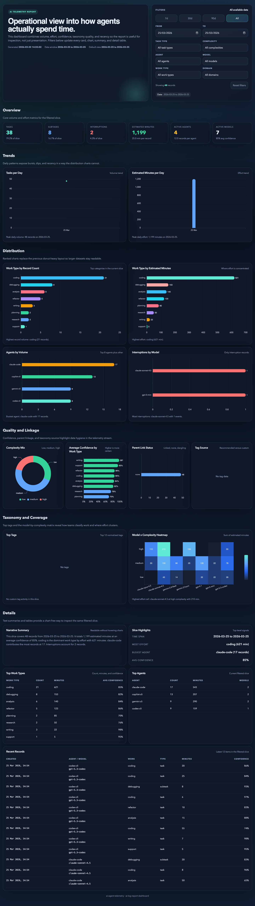

# AI Agent Telemetry Logger

A lightweight telemetry system for AI CLI agents. Agents self-report their activity as structured metadata. Data is stored locally in SQLite and can be analysed with the companion reporting tool.



> **Prefer MCP?** Use [`ai-log-mcp`](https://github.com/3n9/ai-log-mcp) — one-command install that wires all three telemetry tools directly into Claude, Gemini, Codex, and Copilot CLI.

## Tools

| Tool | Purpose |
|---|---|
| `ai-log` | Ingest telemetry records |
| `ai-log-report` | Query, chart, and export telemetry |

## Install

**One-liner (macOS and Linux):**

```sh
curl -fsSL https://raw.githubusercontent.com/3n9/ai-agent-telemetry/main/scripts/install.sh | sh
```

Installs `ai-log` and `ai-log-report` to `~/.local/bin` by default. Override with `INSTALL_DIR=/usr/local/bin sh`.

**Build from source** (requires Go 1.21+):

```sh
make build          # builds native binaries into dist/
make all            # cross-compiles for all platforms
```

**Windows / manual download:** grab the `.zip` from the [releases page](https://github.com/3n9/ai-agent-telemetry/releases) and extract to a directory on your `%PATH%`.

## Quick start

```sh
# 1. Initialise the database (run once)
ai-log init

# 2. Log a task
ai-log emit '{
  "schema_version": 1,
  "agent_name": "my-agent",
  "model_name": "gpt-5",
  "work_type": "coding",
  "language": "typescript",
  "domain": "backend",
  "complexity": "medium",
  "confidence": 0.85,
  "estimated_time_min": 20,
  "task_type": "task"
}'

# 3. View a summary
ai-log-report summary
ai-log-report summary --by work_type
ai-log-report summary --by model_name
```

## ai-log commands

```sh
ai-log init                          # create database
ai-log emit '<json>'                 # store telemetry record
ai-log emit --task-id=<id> '<json>'  # use explicit task ID
ai-log emit --parent-task-id=<id> '<json>'  # link to parent
ai-log validate '<json>'             # dry-run validation
```

All output is JSON. The database path defaults to `~/.local/ai-telemetry/telemetry.db` and can be overridden with the `AI_LOG_DB` environment variable.

## ai-log-report commands

```sh
ai-log-report summary                    # overall counts
ai-log-report summary --by work_type     # group by dimension
ai-log-report summary --by model_name
ai-log-report summary --by complexity
ai-log-report summary --by domain
ai-log-report chart bar                  # terminal bar chart
ai-log-report chart bar --metric estimated_time_min
ai-log-report chart pie
ai-log-report dashboard                  # HTML dashboard, defaults to last 30 days of data
ai-log-report dashboard --range 7d
ai-log-report dashboard --range all
ai-log-report export csv                 # export to stdout
ai-log-report export json
```

## Payload reference

**Required fields:** `schema_version` · `agent_name` · `model_name` · `work_type` · `complexity` · `confidence` · `estimated_time_min` · `task_type`

**Optional fields:** `secondary_work_type` · `language` · `domain` · `custom_tags` · `parent_task_id` · `input_tokens` · `output_tokens` · `cost_estimate`

| Field | Values |
|---|---|
| `complexity` | `low` · `medium` · `high` |
| `task_type` | `task` · `subtask` · `interruption` |
| `confidence` | 0.0 – 1.0 |
| `estimated_time_min` | 1 – 240 |

See [`specs/05_technical_spec.md`](specs/05_technical_spec.md) for the full schema and vocabulary lists.

## Integrating with your AI agent

Copy the appropriate prompt from the `prompts/` directory:

| Agent | File | How to apply |
|---|---|---|
| Generic / any | `prompts/system-prompt.md` | Add to system prompt |
| Claude Code | `prompts/claude-code.md` | Add to `CLAUDE.md` |
| GitHub Copilot CLI | `prompts/copilot.md` | Add to `.github/copilot-instructions.md` |
| Gemini CLI | `prompts/gemini.md` | Add to `GEMINI.md` |
| OpenAI Codex CLI | `prompts/codex.md` | Add to `AGENTS.md` |

For MCP-first integration, see the [`ai-log-mcp`](https://github.com/3n9/ai-log-mcp) companion repo.

## Demo

Seed a local demo database and explore the reports:

```sh
bash demo/seed.sh      # populate demo/telemetry.db with ~50 records
```

**Terminal reports:**

```
$ AI_LOG_DB=demo/telemetry.db ai-log-report summary --by work_type

WORK_TYPE             Count  Est. minutes
--------------------  -----  ------------
coding                21     621
debugging             8      153
analysis              6      140
refactor              5      123
writing               3      22
planning              2      85
research              2      50
support               1      5
```

```
$ AI_LOG_DB=demo/telemetry.db ai-log-report chart bar --by model_name

MODEL_NAME Distribution (count)

claude-sonnet-4.5 │ ████████████████████████████████████████ 14
gpt-4.1           │ █████████████████████████████ 10
gpt-5.3-codex     │ ██████████████████████████ 9
gemini-2.0-flash  │ ██████████████ 5
gemini-2.0-pro    │ ███████████ 4
claude-opus-4.5   │ █████████ 3
gpt-5-mini        │ █████████ 3
```

**HTML dashboard:**

```sh
AI_LOG_DB=demo/telemetry.db ai-log-report dashboard
```

## Privacy

Only task metadata is stored. No file paths, source code, prompts, or user messages are ever recorded.

## Build targets

```sh
make build          # native binary (dist/)
make all            # all platforms (dist/<os>-<arch>/)
make clean
```

Cross-compiled targets: `darwin-arm64`, `darwin-amd64`, `linux-amd64`, `windows-amd64`.
